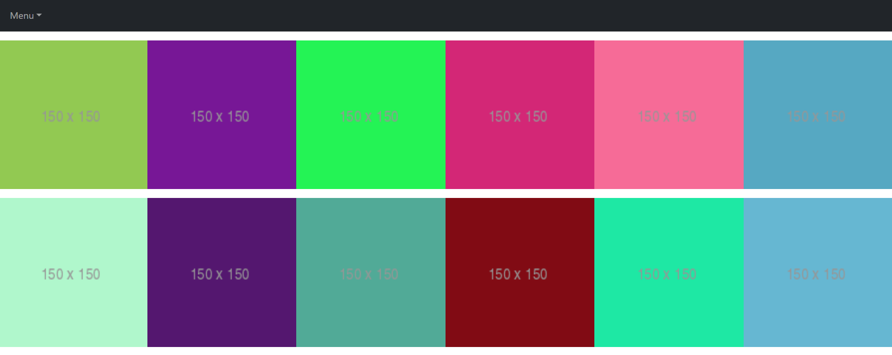

# Сайт-галерея
### Присутствуют 3 страницы (роута):

## «Галерея» (главная страница)

## «Обо мне»

## «Подробности о картинке»

### При создании SPA использовались технологии и инструменты:
* React
* React-bootstrap
* React-router
* Axios
* Redux
* Redux-saga
* Git 

### Просмотр работы кода: [https://yuliyabaskakova3012.github.io/gallery-app/](https://yuliyabaskakova3012.github.io/gallery-app/)
