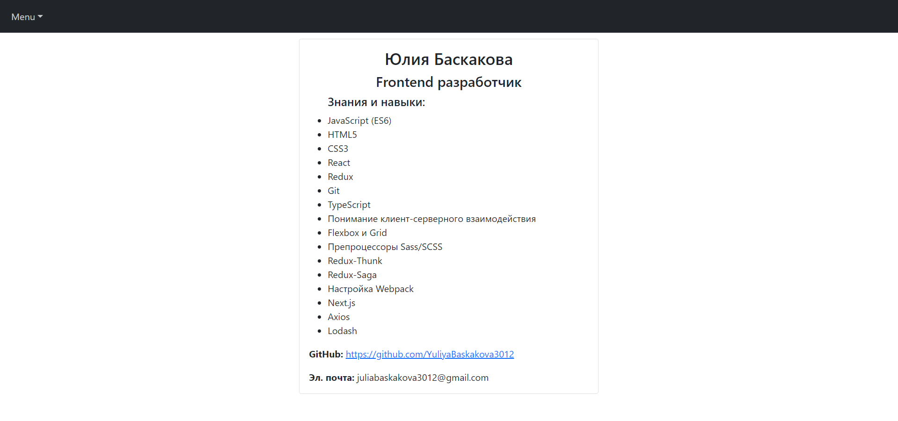

# Сайт-галерея
### Присутствуют 3 страницы (роута):

## «Галерея» (главная страница)
#### Cодержит 4 категории, где в каждой категории присутствуют 6 картинок (итого подгружаются с сервера только 24 первые картинки и разбиваются по 4-м категориям).
#### При наведении мышью на картинку, поверх неё появляется кнопка «Подробнее», при клике на которую совершается переход на отдельную страницу с подробностями о картинке.
#### При загрузке данных с сервера отображается сначала лоадер, а только потом подгруженный контент. Дополнительно создана искусственная задержка в 0.5 секунд.
#### Присутствует хэдер с «меню-бургером». При нажатии на него слева всплывает навигационное меню, где присутствуют 2 ссылки («Галерея» и «Обо мне»), а также отображается  аватар, имя и почтовый адрес.

## «Обо мне»
#### Короткий рассказ о моих знаниях и навыках. Страница сделана отдельным роутом, при этом сохраняются хэдер и «меню-бургер».

## «Подробности о картинке»
#### Cоздана карточка, куда выводится краткая информация о картинке и сама картинка.
#### Добавлен лоадер с задержкой в 0.5 секунд.
#### Сделана кнопка «Назад», при нажатии на которую происходит переход на главную страницу.

### При создании SPA использовались технологии и инструменты:
* React
* React-bootstrap
* React-router
* Axios
* Redux
* Redux-saga
* Git 

### Просмотр работы кода: [https://yuliyabaskakova3012.github.io/gallery-app/](https://yuliyabaskakova3012.github.io/gallery-app/)
